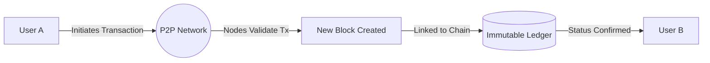
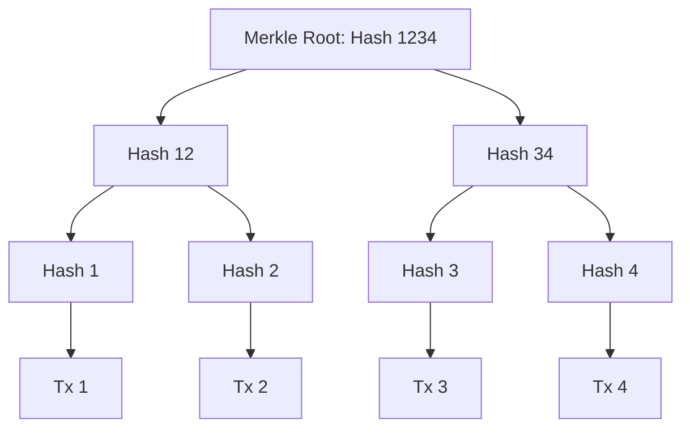
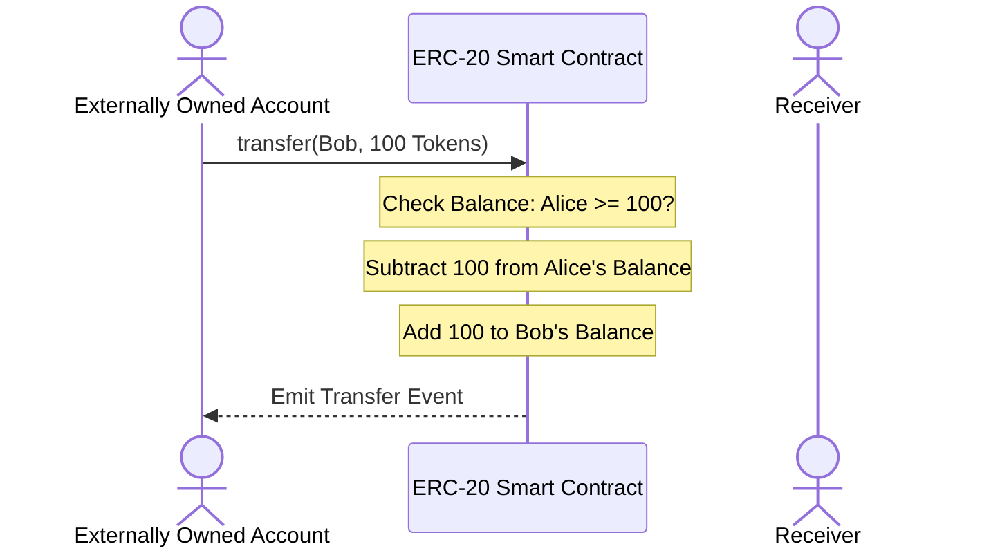

# The Ultimate Blockchain Learning Guide & Reference Manual

Welcome to your comprehensive guide on blockchain technology, Ethereum, smart contracts, and decentralized application (dApp) development. This document is designed to support you from your current intermediate stage all the way through advanced blockchain architecture, cryptography, security, and Web3 development.

---

## Table of Contents
1. [Introduction to Blockchain](#1-introduction-to-blockchain)
   - [What is Blockchain?](#what-is-blockchain)
   - [Why Was Blockchain Created?](#why-was-blockchain-created)
   - [The Problems Blockchain Solves](#the-problems-blockchain-solves)
2. [History and Evolution](#2-history-and-evolution)
   - [The Origins of Blockchain](#the-origins-of-blockchain)
   - [Bitcoin and Decentralized Ledgers](#bitcoin-and-decentralized-ledgers)
   - [The Evolution: Bitcoin to Ethereum and Beyond](#the-evolution-bitcoin-to-ethereum-and-beyond)
   - [Major Milestones Timeline](#major-milestones-timeline)
3. [Core Concepts](#3-core-concepts)
   - [Blocks, Chains, and Hashing](#blocks-chains-and-hashing)
   - [Transactions and Distributed Ledgers](#transactions-and-distributed-ledgers)
   - [Cryptography & Digital Signatures](#cryptography--digital-signatures)
   - [Consensus Mechanisms](#consensus-mechanisms)
   - [Nodes and Decentralized Networks](#nodes-and-decentralized-networks)
   - [Immutability and Transparency](#immutability-and-transparency)
4. [Blockchain Architecture](#4-blockchain-architecture)
   - [Internal Workings and Data Structures](#internal-workings-and-data-structures)
   - [Merkle Trees and Patricia Tries](#merkle-trees-and-patricia-tries)
   - [Block Creation and Validation Workflow](#block-creation-and-validation-workflow)
   - [Mining vs. Staking](#mining-vs-staking)
5. [The Ethereum Ecosystem](#5-ethereum-ecosystem)
   - [What is Ethereum?](#what-is-ethereum)
   - [The Ethereum Virtual Machine (EVM)](#the-ethereum-virtual-machine-evm)
   - [Gas and Transaction Fees (EIP-1559)](#gas-and-transaction-fees-eip-1559)
   - [Accounts: EOA vs. Contract Accounts](#accounts-eoa-vs-contract-accounts)
   - [Token Standards (ERC-20, ERC-721, ERC-1155)](#token-standards-erc-20-erc-721-erc-1155)
6. [Smart Contracts](#6-smart-contracts)
   - [Definition and Mechanics](#definition-and-mechanics)
   - [Solidity Code Example & Explanation](#solidity-code-example--explanation)
   - [Benefits, Limitations, and Use Cases](#benefits-limitations-and-use-cases)
   - [Security and Common Vulnerabilities](#security-and-common-vulnerabilities)
7. [Blockchain Types](#7-blockchain-types)
   - [Public, Private, Consortium, and Hybrid Blockchains](#public-private-consortium-and-hybrid-blockchains)
   - [Comparison Matrix](#comparison-matrix)
8. [Real-World Applications](#8-real-world-applications)
   - [DeFi, NFTs, Supply Chain, Healthcare, etc.](#defi-nfts-supply-chain-healthcare-etc)
9. [Advantages and Challenges](#9-advantages-and-challenges)
   - [The Blockchain Trilemma](#the-blockchain-trilemma)
   - [Scalability, Privacy, and Energy Consumption](#scalability-privacy-and-energy-consumption)
10. [Current State of Blockchain](#10-current-state-of-blockchain)
    - [Adoption, Major Platforms, and CBDCs](#adoption-major-platforms-and-cbdcs)
11. [The Future of Blockchain](#11-the-future-of-blockchain)
    - [Layer-2 Scaling, Interoperability, Web3, and AI](#layer-2-scaling-interoperability-web3-and-ai)
12. [Blockchain Development Roadmap](#12-blockchain-development-roadmap)
    - [Skills, Learning Path, and Tooling](#skills-learning-path-and-tooling)
13. [Essential Resources](#13-essential-resources)
14. [Glossary](#14-glossary)
15. [Conclusion](#15-conclusion)

---

## 1. Introduction to Blockchain

### What is Blockchain?
A **blockchain** is a decentralized, distributed, and immutable digital ledger that records transactions across a peer-to-peer (P2P) network. Rather than relying on a single, trusted central authority (like a bank or government), the network achieves consensus among participant computers (nodes) to validate and verify entries.



### Why Was Blockchain Created?
Blockchain was created to eliminate the necessity for **trusted third parties** in financial transactions. In the traditional financial system, third parties enforce trust, prevent double-spending, and maintain records. However, this introduces several systemic flaws:
- **Central Points of Failure:** Central databases are vulnerable to hacks, corruption, and hardware failures.
- **High Fees:** Intermediaries charge fees for processing payments.
- **Lack of Transparency & Access:** Billions of people remain unbanked, and corporate ledgers are opaque.

### The Problems Blockchain Solves
1. **The Double-Spending Problem:** In digital cash systems, copying digital assets is easy. Blockchain ensures that a digital token cannot be spent more than once without needing a central ledger.
2. **Trust Deficit:** By replacing institutional trust with mathematical and cryptographic proof, transactions can occur directly between strangers.
3. **Censorship & Manipulation:** Once data is written to a public blockchain, it cannot be modified or deleted by governments or corporations.

---

## 2. History and Evolution

### The Origins of Blockchain
The concepts underlying blockchain did not emerge overnight:
- **1991:** Stuart Haber and W. Scott Stornetta proposed a cryptographically secured chain of blocks to timestamp documents so they could not be backdated or tampered with.
- **1998:** Wei Dai described **b-money**, an anonymous, distributed electronic cash system.
- **2005:** Hal Finney introduced **RPOW** (Reusable Proof of Work), which used cryptographic proof-of-work tokens to create a form of digital money.

### Bitcoin and Decentralized Ledgers
In **October 2008**, an anonymous entity named **Satoshi Nakamoto** published the whitepaper *Bitcoin: A Peer-to-Peer Electronic Cash System*. 
- **January 2009:** The Bitcoin network went live with the mining of the genesis block (Block 0).
- Bitcoin solved the double-spending problem by combining asymmetric cryptography, peer-to-peer networking, and a proof-of-work consensus algorithm.

### The Evolution: Bitcoin to Ethereum and Beyond
The progression of blockchain technology is often divided into generations:

```
┌─────────────────────────┐      ┌─────────────────────────┐      ┌─────────────────────────┐
│     Generation 1.0      │      │     Generation 2.0      │      │     Generation 3.0      │
│  Decentralized Currency │ ───> │     Smart Contracts     │ ───> │  Scalability & Interop  │
│  (Bitcoin, Litecoin)    │      │  (Ethereum, EVM Chain)  │      │  (Solana, Polkadot, L2) │
└─────────────────────────┘      └─────────────────────────┘      └─────────────────────────┘
```

- **Blockchain 1.0 (Currency):** Focused entirely on peer-to-peer cash transfer. Bitcoin serves as a store of value ("digital gold"), but its scripting language is intentionally limited to prevent bugs and security vulnerabilities.
- **Blockchain 2.0 (Smart Contracts):** Launched in 2015 by Vitalik Buterin, **Ethereum** introduced a Turing-complete programming language (Solidity) running on the Ethereum Virtual Machine (EVM). This allowed developers to deploy self-executing contracts, giving rise to Decentralized Finance (DeFi) and decentralized applications (dApps).
- **Blockchain 3.0 (Scalability & Interoperability):** Modern blockchains focus on high throughput, low latency, and cross-chain communication (e.g., Layer-2 Rollups, Solana, Avalanche, Polkadot, Cosmos).

### Major Milestones Timeline
| Year | Milestone | Description |
| :--- | :--- | :--- |
| **2008** | Bitcoin Whitepaper | Published by Satoshi Nakamoto. |
| **2009** | Bitcoin Genesis Block | Block 0 is mined; first transaction sent to Hal Finney. |
| **2013** | Ethereum Whitepaper | Published by Vitalik Buterin, proposing smart contracts. |
| **2015** | Ethereum Launch | The Frontier network goes live. |
| **2016** | The DAO Hack | A major hack leading to a hard fork splitting Ethereum (ETH) and Ethereum Classic (ETC). |
| **2020** | Beacon Chain Launch | The first phase of Ethereum's transition to Proof of Stake. |
| **2021** | DeFi & NFT Boom | Massive adoption of decentralized exchanges (DEXs) and digital art tokenization. |
| **2022** | The Merge | Ethereum officially transitions from Proof of Work to Proof of Stake, reducing energy consumption by 99.95%. |
| **2024** | Bitcoin Spot ETFs | Institutional validation of blockchain assets in mainstream finance. |

---

## 3. Core Concepts

### Blocks, Chains, and Hashing
A blockchain is constructed from two main elements:
1. **Blocks:** Containers for data (transactions) along with a **Block Header**.
2. **Chain:** The cryptographic links connecting the blocks.

```
+--------------------------+     +--------------------------+     +--------------------------+
|         Block 0          |     |         Block 1          |     |         Block 2          |
|--------------------------|     |--------------------------|     |--------------------------|
| Prev Hash: 000000000000  |     | Prev Hash: Hash(Block 0) |     | Prev Hash: Hash(Block 1) |
| Tx Data: [Tx0, Tx1]      | <---| Tx Data: [Tx2, Tx3]      | <---| Tx Data: [Tx4, Tx5]      |
| Nonce: 84729             |     | Nonce: 10423             |     | Nonce: 69201             |
| Hash: Hash(Block 0)      |     | Hash: Hash(Block 1)      |     | Hash: Hash(Block 2)      |
+--------------------------+     +--------------------------+     +--------------------------+
```

Every block contains:
- **Previous Block Hash:** The cryptographic signature of the preceding block, creating the back-link.
- **Transactions:** The ledger records.
- **Nonce (Number used Once):** A variable adjusted by miners/validators to find a hash that meets the network's difficulty target.
- **Merkle Root:** A single hash representing all transactions inside the block.

### Cryptographic Hashing
A **cryptographic hash function** takes an input of any size and returns a fixed-size string of characters. 
- **Bitcoin uses:** SHA-256 (Secure Hash Algorithm 256-bit).
- **Ethereum uses:** Keccak-256 (a SHA-3 variant).

Properties of a Cryptographic Hash:
1. **Deterministic:** The same input always produces the exact same output.
2. **Quick Computation:** Calculating the hash for any input is fast.
3. **Pre-image Resistance (One-Way):** Given a hash, it is computationally impossible to reconstruct the original input.
4. **Small Change, Large Impact (Avalanche Effect):** A tiny change in input completely changes the output.
5. **Collision Resistance:** It is highly improbable to find two different inputs that produce the same output hash.

### Cryptography & Digital Signatures
Blockchain relies heavily on **Asymmetric Cryptography** (Public-Key Cryptography):
- **Private Key:** A secret number, known only to the owner, used to sign transactions and authorize transfers.
- **Public Key:** Derived mathematically from the private key (using Elliptic Curve Cryptography, specifically the **secp256k1** curve in Bitcoin and Ethereum). It acts as the user's public identity.
- **Address:** A shortened representation of the public key (e.g., `0x71C...` on Ethereum).

```
[ Private Key ] --(Elliptic Curve Cryptography)--> [ Public Key ] --(Hashing)--> [ Wallet Address ]
```

> [!WARNING]
> The private key is the ultimate authority over your assets. If you lose your private key, you lose access to your funds forever. If someone steals it, they can steal all your assets instantly.

### Consensus Mechanisms
Consensus mechanisms ensure all participants in the distributed network agree on the current state of the blockchain.

#### 1. Proof of Work (PoW)
Nodes (miners) solve a computationally expensive puzzle to find a valid nonce.
- **Pros:** Highly secure, decentralized, historically proven.
- **Cons:** High energy consumption, slow transaction finality.
- **Examples:** Bitcoin, Litecoin.

#### 2. Proof of Stake (PoS)
Validators lock up a cryptocurrency deposit (stake) as collateral. The network selects a validator to propose and vote on the next block based on their stake size and duration.
- **Pros:** Energy-efficient, faster transaction finality, allows for economic penalties (slashing) for bad actors.
- **Cons:** Risk of centralization ("the rich get richer"), complex protocol design.
- **Examples:** Ethereum, Cardano.

#### 3. Other Mechanisms
- **Delegated Proof of Stake (DPoS):** Token holders elect delegates to secure the network (e.g., Tron, EOS).
- **Proof of Authority (PoA):** Pre-approved nodes run the network, relying on reputation rather than capital or computation (commonly used in private or test networks).

| Feature | Proof of Work (PoW) | Proof of Stake (PoS) |
| :--- | :--- | :--- |
| **Resource Needed** | Computational Power (ASICs/GPUs) | Capital / Collateral (Staked Tokens) |
| **Security Foundation** | Physics & Electricity (Hash Rate) | Game Theory & Economic Incentives |
| **Throughput** | Low (7-15 TPS) | High (Thousands of TPS with L2/sharding) |
| **Attack Vector** | 51% Hash Power Takeover | 51% of Total Staked Tokens |
| **Energy Impact** | High | Low (~99.95% reduction from PoW) |

---

## 4. Blockchain Architecture

### Merkle Trees
To verify that transactions are included in a block without downloading the entire block, blockchains use **Merkle Trees**. A Merkle Tree is a binary tree of hashes.



- **Verification:** If a user wants to verify that `Tx 3` is valid, they only need `Hash 4` and `Hash 12` (the **Merkle Proof**) along with the root, rather than having to download all other transactions.

### State Trees in Ethereum
Ethereum uses a more complex trie structure called the **Modified Merkle Patricia Trie** to store:
- **State Trie:** All accounts, balances, smart contract code, and nonces.
- **Storage Trie:** Storage variables for individual smart contracts.
- **Transactions Trie:** All transactions in a block.
- **Receipts Trie:** Outlines transaction outcomes, including event logs.

### Block Creation and Validation Workflow
1. **Transaction Submission:** A user signs a transaction with their private key and broadcasts it to the network.
2. **Mempool:** Nodes receive the transaction, validate its signature, and place it in their local memory pool (Mempool).
3. **Block Proposing:** A validator (or miner) collects transactions from the Mempool, structures them into a block candidate, and calculates the Merkle root.
4. **Consensus & Propagation:** The proposed block is broadcasted. Other nodes verify the block's transactions and consensus requirements.
5. **Finality:** The block is appended to the chain. The state is updated, and the transaction is finalized.

---

## 5. The Ethereum Ecosystem

### What is Ethereum?
Ethereum is a decentralized, public, open-source blockchain featuring smart contract functionality. It is designed to act as a **world computer** that executes arbitrary code securely in a decentralized environment.

### The Ethereum Virtual Machine (EVM)
The **EVM** is the runtime environment for smart contracts in Ethereum.
- It is a stack-based, quasi-Turing-complete virtual machine.
- Every node in the network runs the EVM, executing the compiled bytecode of smart contracts to verify state changes.

### Gas and Transaction Fees
To prevent infinite loops (Halting Problem) and spam, execution resources on Ethereum are limited by **Gas**.
- **Gas:** A unit measuring the computational effort required to execute an operation.
- **Gas Price:** The amount of Ether (ETH) a user is willing to pay per unit of gas, denominated in **Gwei** ($1 \text{ Gwei} = 10^{-9} \text{ ETH}$).

Since **EIP-1559** (London Hard Fork), transaction fees are calculated as:

$$\text{Total Fee} = \text{Gas Used} \times (\text{Base Fee} + \text{Priority Fee})$$

- **Base Fee:** The minimum fee required to include a transaction in a block (automatically burned).
- **Priority Fee:** A tip paid directly to the validator to incentivize fast execution.
- **Gas Limit:** The maximum amount of gas a user allows a transaction to consume.

### Accounts: EOA vs. Contract Accounts
Ethereum operates on an account-based model with two types of accounts:
1. **Externally Owned Accounts (EOA):**
   - Controlled by a private key.
   - Can hold Ether and send transactions to other EOAs or contracts.
   - Has no smart contract code.
2. **Contract Accounts:**
   - Controlled by code deployed on the blockchain.
   - Has its own storage and logic.
   - Cannot initiate transactions on its own; must be triggered by an EOA or another contract call.

### Token Standards
Ethereum standardizes assets through Ethereum Request for Comments (ERC) templates:
- **ERC-20:** Standard interface for fungible (identical) tokens (e.g., USDT, LINK, UNI).
- **ERC-721:** Standard interface for non-fungible (unique) tokens (NFTs) (e.g., CryptoPunks, digital art).
- **ERC-1155:** Multi-token standard allowing a single contract to represent fungible, semi-fungible, and non-fungible tokens simultaneously, saving deployment and gas fees.

---

## 6. Smart Contracts

### What are Smart Contracts?
A **smart contract** is a self-executing program stored on the blockchain. It automatically executes, controls, or documents relevant actions according to the terms of a contract or agreement written in code.



### Solidity Code Example
Below is an intermediate-level Solidity smart contract demonstrating state variables, mappings, modifiers, and event logs.

```solidity
// SPDX-License-Identifier: MIT
pragma solidity ^0.8.20;

/**
 * @title SimpleBank
 * @dev A basic smart contract for depositing, withdrawing, and tracking balances.
 */
contract SimpleBank {
    // State variables (persisted in contract storage)
    address public owner;
    mapping(address => uint256) private balances;

    // Events allow external clients (dApp frontends) to monitor contract activities
    event Deposit(address indexed user, uint256 amount);
    event Withdraw(address indexed user, uint256 amount);
    event OwnerChanged(address indexed oldOwner, address indexed newOwner);

    // Modifiers define preconditions for function execution
    modifier onlyOwner() {
        require(msg.sender == owner, "Error: Caller is not the owner");
        _; // Continues execution of the modified function
    }

    modifier hasSufficientBalance(uint256 amount) {
        require(balances[msg.sender] >= amount, "Error: Insufficient balance");
        _;
    }

    // Constructor runs once during contract deployment
    constructor() {
        owner = msg.sender;
    }

    /**
     * @notice Deposit Ether into the bank.
     */
    function deposit() external payable {
        require(msg.value > 0, "Error: Deposit must be greater than zero");
        balances[msg.sender] += msg.value;
        emit Deposit(msg.sender, msg.value);
    }

    /**
     * @notice Withdraw Ether from the bank.
     * @param amount The amount of Wei to withdraw.
     */
    function withdraw(uint256 amount) external hasSufficientBalance(amount) {
        // State update before transfer to prevent Reentrancy attacks
        balances[msg.sender] -= amount;

        // Perform external call (transfer ether)
        (bool success, ) = payable(msg.sender).call{value: amount}("");
        require(success, "Error: Transfer failed");

        emit Withdraw(msg.sender, amount);
    }

    /**
     * @notice Fetch the balance of a specific user.
     * @param user Address of the user.
     */
    function getBalance(address user) external view returns (uint256) {
        return balances[user];
    }

    /**
     * @notice Transfer ownership of the contract.
     * @param newOwner Address of the new owner.
     */
    function transferOwnership(address newOwner) external onlyOwner {
        require(newOwner != address(0), "Error: Invalid new owner address");
        emit OwnerChanged(owner, newOwner);
        owner = newOwner;
    }
}
```

### Security and Common Vulnerabilities
Deploying code to the blockchain is permanent. Bugs cannot be hotpatched easily. Common vulnerabilities include:
- **Reentrancy:** An attacker contract calls a withdraw function, gets funds, and intercepts control before the balance updates, recalling the withdraw function repeatedly.
  - *Mitigation:* Update states before sending funds (Checks-Effects-Interactions pattern), or use OpenZeppelin's `ReentrancyGuard` modifier.
- **Integer Overflow/Underflow:** Arithmetic wrapping (e.g., $0 - 1 = 2^{256} - 1$).
  - *Mitigation:* Modern Solidity ($0.8.0+$) halts execution automatically on overflow.
- **Access Control Vulnerability:** Forgetting to restrict critical admin functions (like `destroyContract`) to `onlyOwner`.

---

## 7. Blockchain Types

Blockchains can be categorized based on their accessibility and governance structures:

1. **Public Blockchain:** Permissionless networks where anyone can read, write, and participate in consensus (e.g., Bitcoin, Ethereum).
2. **Private Blockchain:** Permissioned networks controlled by a single organization. Only authorized users can join (e.g., Hyperledger Fabric, Corda).
3. **Consortium Blockchain:** Multi-organization permissioned network where consensus is managed by a pre-selected group of members (e.g., R3, B3i).
4. **Hybrid Blockchain:** A combination of public and private features, allowing organizations to run private networks while anchoring critical data to public ledgers for cryptographic verification.

### Comparison Matrix
| Attribute | Public Blockchain | Private Blockchain | Consortium Blockchain | Hybrid Blockchain |
| :--- | :--- | :--- | :--- | :--- |
| **Access** | Open to anyone | Restricted (Single Org) | Restricted (Multi Org) | Mixed (Public/Private) |
| **Speed** | Slower (latency due to size) | Extremely Fast | Fast | Varies |
| **Consensus** | Decentralized (PoW/PoS) | Centralized (PoA/PBFT) | Collaborative | Flexible |
| **Immutability** | High | Low (Org can roll back) | Medium | High |
| **Efficiency** | Low (High redundancy) | High | High | Medium |

---

## 8. Real-World Applications

* **Decentralized Finance (DeFi):** Financial services (lending, borrowing, insurance, trading) running on smart contracts, removing banks (e.g., Uniswap, Aave).
* **Non-Fungible Tokens (NFTs):** Tokenizing ownership of unique items like art, music, collectible cards, and virtual real estate.
* **Supply Chain Management:** End-to-end transparency. Tracking raw materials from resource extraction to retail shelves (e.g., VeChain).
* **Healthcare:** Storing and sharing medical records securely with patient consent, preventing duplication and tampering.
* **Decentralized Identity (DID):** Giving users control over their digital identities, eliminating reliance on centralized social logins (Google/Facebook).
* **Voting Systems:** Tamper-proof voting records that anyone can audit, protecting democratic systems from fraud.

---

## 9. Advantages and Challenges

### The Blockchain Trilemma
Coined by Vitalik Buterin, the Trilemma states that it is extremely difficult for a blockchain database to achieve all three characteristics simultaneously:

```
                  [ Decentralization ]
                         /\
                        /  \
                       /    \
                      /      \
     [ Security ] —————————————— [ Scalability ]
```

1. **Decentralization:** Processing is spread across many nodes.
2. **Security:** Resistance to attacks and validation integrity.
3. **Scalability:** The ability to process massive transaction volumes quickly.

Most designs compromise one for the other. For example, Bitcoin is highly decentralized and secure but processes only $7$ transactions per second. Solana is fast and secure but has higher node hardware requirements, leading to more centralization.

### Main Challenges
- **Scalability:** Blockchains are limited in capacity. Layer-1 improvements and Layer-2 scaling are needed to match Visa's throughput (~24,000 TPS).
- **Privacy:** Public ledgers display all transaction amounts and addresses. Technologies like Zero-Knowledge Proofs (ZKPs) are working to resolve this.
- **Regulatory Uncertainty:** Global jurisdictions struggle to classify cryptocurrencies, smart contract liability, and tax rules.

---

## 10. Current State of Blockchain

Today, blockchain is moving past speculative hype toward institutional integration:
- **Institutional Adoption:** BlackRock, Fidelity, and other major funds offer cryptocurrency ETFs.
- **Enterprise Blockchains:** IBM, Oracle, and Microsoft run permissioned business infrastructure.
- **Central Bank Digital Currencies (CBDCs):** Over 100 countries are exploring digital cash issued by central banks (e.g., China's e-CNY, European Digital Euro pilot).
- **Leading Platforms:**
  - **Ethereum (L1):** The leader in liquidity, developer tooling, and smart contract volume.
  - **Solana (L1):** High-speed, low-cost execution using Proof of History (PoH).
  - **Arbitrum / Optimism / Base (L2):** Rollup networks scaling Ethereum execution at low costs.

---

## 11. The Future of Blockchain

Over the next 5 to 10 years, blockchain development will be dominated by:
- **Layer-2 Rollups & Modular Architectures:** Splitting blockchains into execution (Layer-2), data availability (Celestia, EigenDA), and consensus layers.
- **Cross-Chain Interoperability:** Bridges and messaging protocols (e.g., Chainlink CCIP, LayerZero) connecting isolated blockchains.
- **Real-World Asset (RWA) Tokenization:** Putting treasury bills, real estate, stocks, and commodities on-chain.
- **AI + Web3 Integration:** AI agents executing financial transactions autonomously via smart contracts; decentralized compute networks (e.g., Render, Akash).

---

## 12. Blockchain Development Roadmap

To become a proficient blockchain engineer, follow this structured learning path:

### Step 1: Foundation (Web2 Developer)
- Learn Javascript, TypeScript, HTML/CSS.
- Learn backend development (Node.js, databases, APIs).
- Understand Git and command-line interfaces.

### Step 2: Blockchain Basics
- Read the [Bitcoin Whitepaper](https://bitcoin.org/bitcoin.pdf) and [Ethereum Whitepaper](https://ethereum.org/en/whitepaper/).
- Master cryptography basics (symmetric encryption, public/private keys, hashing).

### Step 3: Smart Contract Development
- Learn **Solidity** (EVM) or **Rust** (Solana/Near).
- Master Solidity concepts: state variables, structures, arrays, mapping, memory vs storage, fallback functions.
- Study **OpenZeppelin** contract libraries (ERC-20, ERC-721, security patterns).

### Step 4: Tooling & Frameworks
- Use **Remix IDE** for quick prototyping.
- Master a command-line framework:
  - **Foundry** (Recommended: Fast, Solidity-native testing, fuzzing).
  - **Hardhat** (JavaScript/TypeScript ecosystem).
- Learn **Ethers.js** or **Viem** for connecting frontend interfaces to smart contracts.

### Step 5: Advanced & Security Auditing
- Study EVM assembly (`Yul`) and EVM opcodes.
- Use static analysis tools: Slither, Mythril.
- Practice DeFi protocol design (automated market makers, liquidity pools, flash loans).

```
[ Beginner: Solidity/Remix ] ──> [ Intermediate: Foundry/TDD ] ──> [ Advanced: EVM Deep Dive/Auditing ]
```

---

## 13. Essential Resources

### Official Documentation
- [Ethereum Developer Portal](https://ethereum.org/en/developers/)
- [Solidity Documentation](https://docs.soliditylang.org/)
- [Foundry Book](https://book.getfoundry.sh/)

### Learning Websites
- [CryptoZombies](https://cryptozombies.io/) - Gamified Solidity tutorial.
- [Speedrun Ethereum](https://speedrunethereum.com/) - Practical challenges to master Ethereum development.
- [EVM Codes](https://www.evm.codes/) - EVM Opcodes interactive guide.

### Must-Read Books
- *Mastering Bitcoin* by Andreas M. Antonopoulos
- *Mastering Ethereum* by Andreas M. Antonopoulos and Gavin Wood

---

## 14. Glossary

* **ASIC (Application-Specific Integrated Circuit):** Specialized computer hardware optimized for mining cryptocurrencies.
* **Block Reward:** Crypto given to miners or validators for successfully adding a block.
* **Decentralized Application (dApp):** An application with a frontend using a blockchain-based smart contract backend.
* **DAO (Decentralized Autonomous Organization):** An organization governed by rules encoded as computer programs and controlled by organization members via tokens.
* **EIP (Ethereum Improvement Proposal):** Design documents describing new features or processes for Ethereum.
* **Fuzzing:** A software testing technique that inputs random data into a smart contract to discover edge-case vulnerabilities.
* **Gas:** The internal unit tracking the computational cost of execution on Ethereum.
* **Hard Fork:** A radical protocol upgrade that is not backward-compatible.
* **Soft Fork:** A backward-compatible upgrade to the blockchain software.
* **Gwei:** Denomination of Ether used to specify gas prices ($1 \text{ Gwei} = 10^{-9} \text{ ETH}$).
* **Mempool:** A node's collection of unconfirmed, pending transactions.
* **Oracles:** Third-party services that feed real-world external data (like token prices or weather details) to smart contracts (e.g., Chainlink).
* **Slashing:** An economic penalty in Proof of Stake where a validator's stake is burned for dishonest or offline behavior.

---

## 15. Conclusion

Blockchain technology is transitioning from an experimental tool into the foundational infrastructure of the internet's next iteration: Web3. By combining cryptography, economics, and distributed systems, blockchain enables trustless, permissionless collaboration on a global scale. As you progress from intermediate smart contract development to advanced EVM manipulation, cryptography, and system architecture, remember that blockchain's core mission is to empower individuals, foster transparency, and decentralize access to opportunity. Happy coding!
