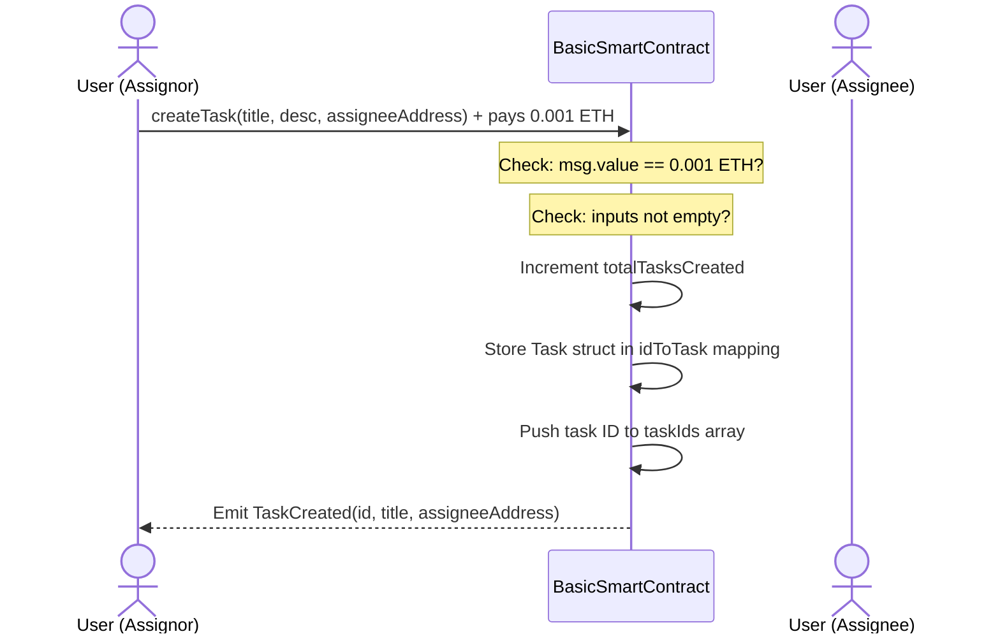

# Complete Solidity Smart Contract Guide: `BasicSmartContract.sol`

This guide provides a comprehensive walkthrough and explanation of [BasicSmartContract.sol](file:///D:/Blockchain/Block chain/BasicSmartContract.sol). It is designed to take you from a basic understanding of programming concepts into intermediate Solidity and smart contract engineering.

---

## 1. Overview

### Purpose of the Smart Contract
[BasicSmartContract.sol](file:///D:/Blockchain/Block chain/BasicSmartContract.sol) is a decentralized **Task Management System**. It enables a contract owner to configure a system where tasks can be logged, paid for, assigned to specific user addresses, and marked as complete by the assignees.

### What Problem It Solves
- **Trustless Task Accountability:** Traditional task trackers rely on a central server database that can be modified or deleted by database administrators. Here, once a task is assigned, its parameters (title, description, assignee, and completion status) are permanently recorded on the blockchain.
- **Micro-payment Collateralization:** The contract collects a `CREATION_FEE` (0.001 ETH) for every task registered. This prevents spammers from cluttering the system and stores gas payment collateral within the contract until the owner withdraws it.

---

## 2. Code Walkthrough

Let's dissect the contract section by section.

### License and Version Pragma
```solidity
// SPDX-License-Identifier: MIT
pragma solidity ^0.8.20;
```
- **Line 1 (`SPDX-License-Identifier`):** Specifying a machine-readable license is required by modern compilers to avoid compiler warnings and support open-source auditing. `MIT` means the code is free to copy and modify.
- **Line 2 (`pragma solidity ^0.8.20`):** Tells the compiler which version of Solidity to use. The caret (`^`) symbol means this contract can compile on version `0.8.20` up to any version before `0.9.0` (which would introduce breaking changes).

### Custom Structs
```solidity
struct Task {
    uint256 id;
    string title;
    string description;
    bool isCompleted;
    address assignedTo;
}
```
- A **`struct`** is a user-defined container type that groups related variables together.
- In this case, each `Task` is packaged with its numeric ID, textual title and description, a boolean flag (`isCompleted`), and the Ethereum `address` of the assignee.

### State Variables
```solidity
address public owner;
uint256 private totalTasksCreated;
mapping(uint256 => Task) private idToTask;
mapping(address => uint256) public userCompletedCount;
uint256[] public taskIds;
uint256 public constant CREATION_FEE = 0.001 ether;
```
- **`owner`:** Stores the address of the deployment account. Marked `public` so Solidity automatically generates an external read-only getter function for it.
- **`totalTasksCreated`:** An internal counter. Marked `private` so it cannot be read directly by other contracts (though remember that all blockchain data is technically visible to public node viewers).
- **`idToTask`:** A mapping keying a `uint256` ID directly to a `Task` struct. Mappings act as fast $O(1)$ lookup hash tables.
- **`taskIds`:** An array storing the history of all task IDs. Arrays are useful for keeping track of enumerable lists since mappings are not natively iterable.
- **`CREATION_FEE`:** Assigned the `constant` modifier. Since this value never changes after compilation, the compiler replaces it inline wherever it's used, saving a significant amount of execution gas by avoiding storage lookups.

### Custom Errors
```solidity
error OnlyOwnerAllowed();
error TaskDoesNotExist(uint256 taskId);
...
```
- **`error`** statements define gas-efficient alternatives to traditional `require` string reverts. Returning long strings (e.g., `require(msg.sender == owner, "Only the contract owner can call this function")`) consumes unnecessary gas because characters must be stored in memory. Custom errors return a 4-byte selector code instead.

### Events
```solidity
event TaskCreated(uint256 indexed taskId, string title, address indexed assignedTo);
```
- **`event`** statements tell the compiler to write logs to the transaction receipt.
- **`indexed`** parameters allow client interfaces (like Web3 frontend libraries) to filter logs matching specific keys (e.g., "Find all events where `assignedTo` is Alice's address").

### Modifiers
```solidity
modifier onlyOwner() {
    if (msg.sender != owner) {
        revert OnlyOwnerAllowed();
    }
    _;
}
```
- Modifiers intercept function calls.
- The `_;` merge wildcard tells Solidity: "If the conditions above pass, paste the body of the function right here and execute it."

---

## 3. Solidity Concepts Covered

Here is a detailed breakdown of core Solidity keywords and terms used in the contract:

| Concept | Description | Usage in `BasicSmartContract.sol` |
| :--- | :--- | :--- |
| **`msg.sender`** | The address that initiated the current transaction call. | Used in `constructor` to assign `owner` and in `completeTask` for verification. |
| **`msg.value`** | The amount of Wei/Ether sent along with the transaction call. | Checked in `createTask` to ensure the sender paid exactly `0.001 ether`. |
| **`view`** | Specifies that a function reads data from storage but does not write/modify it. | Used in `getTaskDetails` and `getTaskCount`. |
| **`pure`** | Specifies that a function neither reads from nor writes to contract storage. | Used in `calculateUrgencyScore` (relies strictly on passed arguments). |
| **`calldata`** | Temporary data location for external function arguments. Read-only and cheaper than `memory`. | Used for strings in `createTask` input arguments. |
| **`memory`** | Temporary data location that persists only during function execution. | Used in `getTaskDetails` to copy a struct instance for returning. |
| **`storage`** | Permanent data location persisted on-chain across transactions. | Used in `completeTask` to create a reference pointer directly to the contract state. |
| **`require` vs `revert`** | Conditional check vs absolute failure. | We use `revert CustomError()` inside `if` statements as it is more gas-optimized than `require(condition, "error string")`. |
| **`assert`** | Used to test for internal invariants (conditions that should never be false under any bug-free circumstances). | If an `assert` fails, it indicates an internal contract bug and drains remaining transaction gas. |

---

## 4. Execution Flow

### Block Deployment Phase
When a developer deploys [BasicSmartContract.sol](file:///D:/Blockchain/Block chain/BasicSmartContract.sol):
1. The EVM allocates storage slots for state variables.
2. The `constructor` executes. `msg.sender` (deployer's address) is written into the `owner` slot.
3. `totalTasksCreated` is initialized to `0`.
4. The compiled contract runtime bytecode is written to the blockchain address.

### Task Creation Workflow


---

## 5. Deployment Guide

### Option A: Using Remix Online IDE
1. Open [Remix IDE](https://remix.ethereum.org/).
2. Create a new file named `BasicSmartContract.sol` and paste the code.
3. In the sidebar, select the **Solidity Compiler** tab. Set compiler version to `0.8.20` or higher, and click **Compile**.
4. Go to the **Deploy & Run Transactions** tab:
   - **Environment:** Select `Remix VM (Merge)` for local testing.
   - Click **Deploy**.
5. The contract will appear under "Deployed Contracts" at the bottom of the sidebar. Expand it to interact with the functions.

### Option B: Using Hardhat (TypeScript)
1. Initialize a Hardhat project:
   ```bash
   npm init -y
   npm install --save-dev hardhat
   npx hardhat init
   ```
2. Save your contract file to the `contracts/` directory.
3. Create a deployment script under `ignition/modules/BasicSmartContract.ts` or `scripts/deploy.js`:
   ```javascript
   const hre = require("hardhat");

   async function main() {
     const Contract = await hre.ethers.getContractFactory("BasicSmartContract");
     const contract = await Contract.deploy();
     await contract.waitForDeployment();
     console.log("Contract deployed to:", await contract.getAddress());
   }

   main().catch((error) => {
     console.error(error);
     process.exitCode = 1;
   });
   ```
4. Run deployment on local network:
   ```bash
   npx hardhat run scripts/deploy.js --network localhost
   ```

### Option C: Using Foundry (Solidity-Native Tooling)
1. Initialize project structure:
   ```bash
   forge init
   ```
2. Put `BasicSmartContract.sol` inside `src/`.
3. Compile the project:
   ```bash
   forge build
   ```
4. Deploy locally using `anvil` (Foundry's built-in local blockchain):
   ```bash
   forge create src/BasicSmartContract.sol:BasicSmartContract --interactive
   ```

---

## 6. Testing & Interaction Examples

Here is how you can interact with the contract and what to expect:

### Interacting with `createTask`
- **Call parameters:**
  - `_title`: `"Audit Smart Contract"`
  - `_description`: `"Run static analysis using Slither and fix vulnerabilities."`
  - `_assignee`: `0x70997970C51812dc3A010C7d01b50e0d17dc79C8` (e.g., Bob's test account address)
  - **Transaction Value:** `0.001 ETH` (or `1000000000000000` Wei)
- **Expected Outcome:** Transaction completes successfully. The contract balance increases by 0.001 ETH.
- **Log Output:** `TaskCreated(taskId: 1, title: "Audit Smart Contract", assignedTo: 0x7099...)`

### Interacting with `completeTask`
- **Call parameters:**
  - Call from address: `0x70997970C51812dc3A010C7d01b50e0d17dc79C8` (Bob)
  - `_taskId`: `1`
- **Expected Outcome:** Transaction completes successfully.
- **Log Output:** `TaskCompleted(taskId: 1, completedBy: 0x7099...)`

> [!NOTE]
> If you call `completeTask(1)` from the owner's address (or any address other than Bob's), the transaction will fail and revert with the `OnlyOwnerAllowed()` custom error.

---

## 7. Security Considerations

### 1. Checks-Effects-Interactions Pattern
When modifying state variables and interacting with other accounts (like transferring Ether), you must always follow this structure:
- **Checks:** Validate inputs and authorization (e.g., `require` checks, modifiers).
- **Effects:** Modify contract state variables (e.g., updates to mappings, balances).
- **Interactions:** Interact with external addresses (e.g., `payable.call{value: val}("")`).

This protects the contract from **Reentrancy Attacks**. In our `withdrawFees` function, we query the balance (Check), reset the balance mentally or verify it, and then call the transfer (Interaction).

### 2. Guarding Against Reentrancy
Consider this withdraw structure:
```solidity
// SAFE (Checks-Effects-Interactions)
function withdrawSafe(uint256 amount) public {
    require(balances[msg.sender] >= amount);
    balances[msg.sender] -= amount; // Effect
    (bool success, ) = msg.sender.call{value: amount}(""); // Interaction
    require(success);
}

// UNSAFE (Vulnerable to Reentrancy)
function withdrawUnsafe(uint256 amount) public {
    require(balances[msg.sender] >= amount);
    (bool success, ) = msg.sender.call{value: amount}(""); // Interaction first
    require(success);
    balances[msg.sender] -= amount; // Effect last (reentrant call bypasses this)
}
```

---

## 8. Learning Summary & Next Steps

### Key Concepts Learned
1. **State Persistence:** How storage arrays and mappings manage data persistent variables on the blockchain.
2. **Access Control:** Restricting administrative operations using modifiers like `onlyOwner`.
3. **Log Emitter Pattern:** Using events to broadcast real-time state changes to external dApp interfaces.
4. **Gas Management:** Designing code with constants and custom errors to save money for users.

### Next Steps for Advanced Study
- **Inheritance & Interfaces:** Study how to inherit open-source contract blocks (like OpenZeppelin's `Ownable` and `ReentrancyGuard`).
- **DeFi Architecture:** Learn how automated market makers (AMMs) like Uniswap maintain liquidity pools using mathematical constant product formulas ($x \times y = k$).
- **Oracle Integrations:** Explore how to query off-chain data securely using decentralized Oracles (like Chainlink price feeds).
